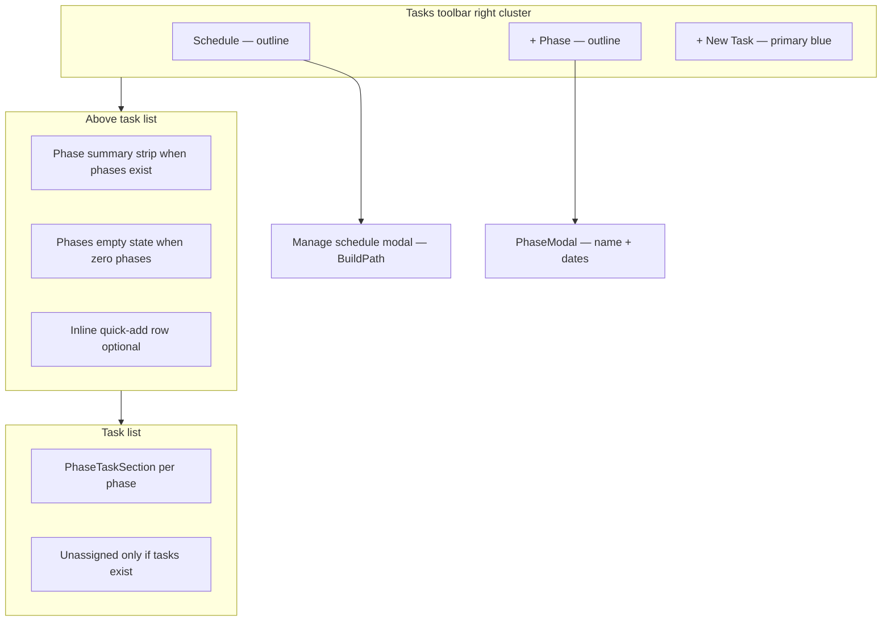

# Integrate phases on Project Details (Tasks tab)

## Problem diagnosis

Phases work in the data model but are hard to discover on the default **Tasks** tab:

| Issue | Where |
|-------|--------|
| Sidebar with `BuildPath` (+ Add Phase) hidden on Tasks / Gantt / Updates | [`ProjectDetailsView.jsx`](apps/web/src/views/ProjectDetailsView.jsx) ~2759–2767 |
| **Manage phases** buried under **Actions** dropdown | ~2538–2548 |
| No CTA when `projectPhases.length === 0` | ~2596–2714 |
| Duplicate phase fetching; list refreshes only when modal closes | `projectPhases` vs `BuildPath` internal state |
| `TaskModal` phase field hidden when no phases | [`TaskModal.jsx`](apps/web/src/components/TaskModal.jsx) ~335 |
| `PhaseTaskSection` uses hardcoded English drag copy; unicode chevrons | [`PhaseTaskSection.jsx`](apps/web/src/components/PhaseTaskSection.jsx) |

User preference: **toolbar + inline empty states / quick-add** (full-width task list preserved).

---

## Target information architecture

**Copy hierarchy (trust + clarity per [`PRODUCT.md`](PRODUCT.md)):**
- Avoid jargon: prefer **Schedule** / **Add phase** over “Manage phases” / “Build path”
- Empty state explains *why* phases matter: “Group tasks by construction stage so your crew sees the right work at the right time.”
- Default template CTA: **Use construction template** (lists 6 default names in helper text, not a surprise insert)

---

## UI/UX design enhancements

### 1. Toolbar visual hierarchy (match existing Tasks tab)

Reuse patterns from filter pills and `+ New Task` ([`ProjectDetailsView.jsx`](apps/web/src/views/ProjectDetailsView.jsx) ~2421–2577):

| Control | Style | Placement |
|---------|--------|-----------|
| **+ New Task** | `bg-blue-600 rounded-full` primary | Rightmost (unchanged) |
| **+ Phase** | `border border-gray-200 rounded-full` secondary + `Icon` (plus) | Left of New Task |
| **Schedule** | Same secondary; layers/stack icon | Opens full `BuildPath` modal for reorder, dates, delete | Left of + Phase |

- Group phase controls in a **`PhasesToolbar`** fragment so wrapping on mobile keeps the cluster together (avoid orphan icon-only buttons).
- **Actions** dropdown retains only Import MS Project + Weather (lower-frequency).
- `data-onboarding="phases-toolbar"` for future tour steps.

### 2. Phase summary strip (when `phases.length > 0`)

Compact bar between toolbar and task list (not a second sidebar):

- **Left:** `N phases · X% overall` (reuse weighted progress from `BuildPath.calculateOverallProgress`, exposed via hook).
- **Center (md+):** horizontal scroll of **phase chips** — name + mini progress bar; click scrolls list to `#phase-{id}` (add `id` on each `PhaseTaskSection`).
- **Right:** **Expand all** / **Collapse all** (updates localStorage keys for all phase sections; respects `prefers-reduced-motion` with instant toggle only).

Reduces scroll hunting on projects with many phases without reintroducing the hidden sidebar.

### 3. Empty state (zero phases)

Match existing **No tasks yet** pattern (~2717–2730): centered icon circle, `h3`, body, two buttons.

New component **`PhasesEmptyState`**:
- Illustration: simple checklist/layers icon (existing gray-100 circle style).
- Primary: **Add phase** → `PhaseModal`.
- Secondary: **Use construction template** → `seedDefaultPhases` with confirm toast listing what was added.
- If tasks already exist: add line — “Your N tasks will stay in **Unassigned** until you assign them (drag or edit task).”

Dismissible **first-visit hint** (localStorage `siteweave.phasesHint.dismissed`): one-line banner above strip, not a modal.

### 4. Inline quick-add (low friction)

At bottom of phase list (editors only): dashed border row **“Add another phase…”** → expands to single-line input + **Add** / **Cancel** (Enter/Esc). Submits via hook without opening full modal. Modal still available for dates.

### 5. `PhaseTaskSection` polish

| Enhancement | Detail |
|-------------|--------|
| **Chevrons** | Replace `▼`/`▶` with shared [`Icon`](apps/web/src/components/Icon.jsx); `aria-expanded` on header |
| **Task count** | Badge next to title: `3 tasks` / `1 task` (i18n) |
| **Unassigned styling** | Subtle amber left border or `border-amber-200` header bg to distinguish from named phases |
| **Empty phase body** | Replace gray-only text with **Add task** button (outline, sm) calling `onAddTaskToPhase(phaseId)` |
| **Header menu** | `⋯` button (`stopPropagation`) — Rename, Delete phase, Add task; only if `canManagePhases` |
| **Drag feedback** | i18n `projectDetail.drop_here` / `drop_to_phase`; keep blue ring (on-brand primary) |
| **Progress bar** | Use green `#10B981` for 100% complete phases per [`DESIGN.md`](DESIGN.md) status colors |

Header click = expand/collapse; menu/drag handle do not toggle (separate hit targets, 44px min touch).

### 6. Manage schedule modal UX

Upgrade existing modal (~3015–3049):

- Title: **Project schedule** (subtitle: phases and progress).
- Sticky header + footer **Done** (primary outline) instead of plain “Close”.
- `BuildPath` receives `onPhasesChange` so edits reflect in list behind modal (dimmed backdrop, live preview).
- Focus trap + `Escape` closes; return focus to triggering button.
- Max height unchanged; internal scroll only.

### 7. Task creation flow

- `TaskModal`: `defaultPhaseId` prop; phase select always visible when phases exist; when zero phases, helper link **Set up phases** triggers empty-state / add flow.
- Optional: show current phase name on `TaskItem` row as small tag (read-only chip) — improves scanability; defer if scope tight.

### 8. Accessibility and motion

- All new buttons: `aria-label` where icon-only on `sm` breakpoints.
- Phase sections: `role="region"` + `aria-labelledby` pointing to phase title id.
- Announce add/delete via existing toasts (screen reader gets toast content).
- Transitions ≤300ms ease-out; no bounce; honor `prefers-reduced-motion` (disable strip scroll smooth behavior).

### 9. Performance optimizations

| Optimization | Implementation |
|--------------|----------------|
| Stop per-render `tasks.filter` per phase | `useMemo` → `tasksByPhaseId: Map<phaseId, Task[]>` + `unassignedTasks` in `ProjectDetailsView` |
| Phase load state | While `useProjectPhases` loading, show 2–3 `SkeletonRow` placeholders instead of empty flash |
| Optimistic add | Insert temp phase row in UI, rollback on error |
| BuildPath in modal | Pass `phases` from parent hook to avoid second fetch |
| Optional later | Supabase realtime on `project_phases` for multi-user — out of initial scope |

---

## Implementation approach (functional)

### 1. Shared phase data layer

[`apps/web/src/hooks/useProjectPhases.js`](apps/web/src/hooks/useProjectPhases.js):
- load / add / update / delete / reorder / `seedDefaultPhases`
- `overallProgress` computed once for summary strip

Refactor [`BuildPath.jsx`](apps/web/src/components/BuildPath.jsx): consume hook; export **`PhaseModal`**.

### 2. New UI components

| Component | Responsibility |
|-----------|----------------|
| `PhasesToolbar.jsx` | Schedule, + Phase, optional summary metrics |
| `PhasesSummaryStrip.jsx` | Chips + expand/collapse all |
| `PhasesEmptyState.jsx` | Zero-phase CTA block |
| `PhaseQuickAdd.jsx` | Inline dashed-row add |

Wire in [`ProjectDetailsView.jsx`](apps/web/src/views/ProjectDetailsView.jsx).

### 3. i18n ([`packages/i18n/locales/en.json`](packages/i18n/locales/en.json) + `es.json`)

New `projectDetail` keys: `add_phase`, `project_schedule`, `phases_empty_title`, `phases_empty_description`, `use_construction_template`, `phases_summary`, `expand_all_phases`, `collapse_all_phases`, `add_task_to_phase`, `phase_task_count_one`, `phase_task_count_other`, `drop_here`, `drop_to_phase`, `quick_add_phase_placeholder`, `phases_hint`, `setup_phases_link`.

Run `npm run check:i18n`.

### 4. Repo parity

Root [`src/`](src/) differs from [`apps/web/src/`](apps/web/src/). Apply to the entrypoint you ship (`npm run dev` uses root `/src`).

---

## Out of scope (follow-ups)

- Full sidebar on Tasks tab
- Gantt phase lane integration
- `TaskItem` inline phase picker (dead `editPhaseId` state)
- Auto-seed phases on project create (explicit CTA only)
- Realtime multi-user phase sync

---

## Verification

**UX**
1. Zero phases: empty state visible; template CTA seeds phases; summary strip appears.
2. Toolbar: + Phase and Schedule obvious without opening Actions.
3. Many phases: chips scroll; expand/collapse all works; click chip scrolls to section.
4. Drag task between phases: localized feedback; unassigned visually distinct.
5. Mobile: toolbar wraps cleanly; touch targets ≥44px.

**Functional**
6. Phase CRUD updates task grouping without closing modal.
7. Add task from empty phase opens modal with phase selected.

**Tech**
8. `npm run check:i18n` passes.
9. No duplicate fetch in modal BuildPath when parent provides phases.
