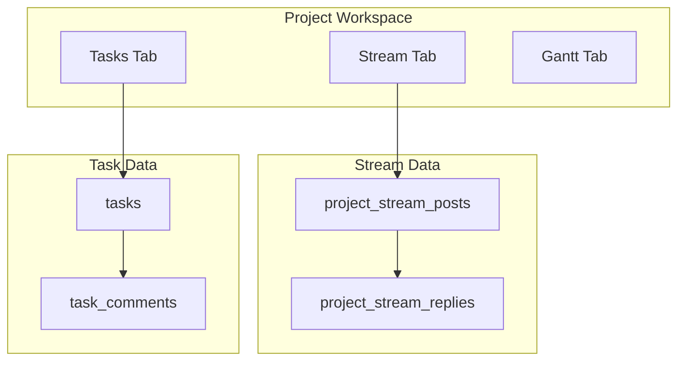

# Project Stream and Task Comments

## Goals

1. **Project Stream** — Per-project feed (not global nav) for daily logs, announcements, and milestone updates. Card-based, documentation-first UI (not chat bubbles). Threaded replies nested under each post.
2. **Task Comments** — All task-scoped discussion lives on the task. No DMs (none exist today). **Public** vs **Internal** visibility replaces DM privacy.

## Current state (codebase audit)

| Area | Today |
|------|--------|
| Messaging tables | `message_channels` → `messages` (per-project channels, often one "{Project} Discussion" channel) |
| DMs | **Not implemented** — Team "Message contact" jumps to a project channel |
| Threads | `parent_message_id` in `messagesService.js` / `src/MessagesView.jsx` — **column not in `schema.sql`** (schema drift) |
| Global UI | Web: `/team` → `TeamHubView` (Discussions + Directory); `/messages` redirects to `/team`. Mobile: **Messages** bottom tab |
| Project workspace tabs | tasks, gantt, field-issues, activity — **no stream tab** |
| Task discussion | `tasks.description` only; no `task_comments` table |
| Internal users | `contact.is_internal` computed in `virtualContactsService` (same `organization_id` as project org) |

Key files:

- [apps/web/src/config/routes.js](apps/web/src/config/routes.js) — add `projectStream: '/projects/:id/stream'`
- [apps/web/src/views/ProjectDetailsView.jsx](apps/web/src/views/ProjectDetailsView.jsx) — tab shell
- [apps/web/src/views/TeamHubView.jsx](apps/web/src/views/TeamHubView.jsx) — strip Discussions
- [packages/core-logic/src/services/messagesService.js](packages/core-logic/src/services/messagesService.js) — reference for patterns; eventually deprecated
- [schema.sql](schema.sql) — canonical DDL; ship changes via [supabase/migrations/](supabase/migrations/)

---

## Architecture

**Design choice: new tables** (not stretch `messages`) so `post_type`, stream-specific fields, and task `visibility` stay explicit. Migrate existing channel messages into stream for history retention (default; confirm with stakeholder if fresh start preferred).

---

## 1. Database

### 1.1 `project_stream_posts`

| Column | Type | Notes |
|--------|------|--------|
| id | UUID PK | |
| project_id | UUID FK | → projects, CASCADE |
| organization_id | UUID FK | → organizations |
| author_id | UUID FK | → auth.users |
| post_type | TEXT | `daily_log`, `announcement`, `milestone`, `general` |
| title | TEXT | Optional; encouraged for announcements/milestones |
| body | TEXT | Required |
| payload | JSONB | Milestone metadata, attachments refs |
| file_url, file_name | TEXT | Optional attachment |
| created_at, updated_at | TIMESTAMPTZ | |

Indexes: `(project_id, created_at DESC)`, `(organization_id, project_id)`.

### 1.2 `project_stream_replies`

| Column | Type | Notes |
|--------|------|--------|
| id | UUID PK | |
| post_id | UUID FK | → project_stream_posts, CASCADE |
| organization_id | UUID FK | |
| author_id | UUID FK | |
| body | TEXT | |
| created_at, updated_at | TIMESTAMPTZ | |

Alternative: single table with `parent_post_id` (like current messages threads). **Prefer separate replies table** for simpler top-level feed queries.

### 1.3 `task_comments`

| Column | Type | Notes |
|--------|------|--------|
| id | UUID PK | |
| task_id | UUID FK | → tasks, CASCADE |
| project_id | UUID FK | Denormalized for RLS/indexing |
| organization_id | UUID FK | |
| author_id | UUID FK | |
| body | TEXT | |
| visibility | TEXT | `public` \| `internal` (CHECK constraint) |
| parent_comment_id | UUID | Optional; nullable FK self-reference for nested replies |
| created_at, updated_at | TIMESTAMPTZ | |

### 1.4 RLS — visibility rules

**Stream posts/replies:** Same project-access pattern as existing `messages` policies (accessible `project_id` in user's project set). No internal/public on stream — project-wide visibility by design.

**Task comments:**

| visibility | Who can SELECT |
|------------|----------------|
| `public` | Anyone with project access (including external subs/guests on project) |
| `internal` | Users whose `profiles.organization_id` = project's `organization_id` (org "core team"; excludes external `project_contacts` from other orgs) |

INSERT: author = `auth.uid()`, must have project access; `visibility = internal` only if user passes org-member check (DB function `user_is_org_member_for_project(project_id)`).

UPDATE/DELETE: own comment or PM/Admin on project (mirror messages policies).

### 1.5 Migration from `messages`

1. For each `message_channels` row: map `project_id` from channel.
2. Top-level messages (`parent_message_id` IS NULL or missing): insert into `project_stream_posts` (`post_type = general`, `body = content`).
3. Thread children: insert into `project_stream_replies`.
4. Leave `message_channels` / `messages` in place **read-only** for one release; drop in follow-up migration after cutover verified.

### 1.6 Permissions (app layer)

- Reuse `can_send_messages` for creating stream posts and public task comments.
- New optional `can_post_internal_comments` in roles JSONB (default true for PM/Admin/Team on owning org); UI hides internal toggle if false.
- RLS remains source of truth for internal visibility.

---

## 2. Services (`packages/core-logic`)

### `streamService.js`

- `fetchStreamPosts(supabase, projectId, { limit, cursor })`
- `fetchStreamReplies(supabase, postId)`
- `createStreamPost`, `createStreamReply`
- `updateStreamPost`, `deleteStreamPost` (author or PM/Admin)
- Enrich authors via existing `fetchUserInfo` pattern from `messagesService.js`

### `taskCommentsService.js`

- `fetchTaskComments(supabase, taskId, { viewerOrgId })` — client-side filter backup; RLS primary
- `createTaskComment({ taskId, body, visibility, parentCommentId })`
- `updateTaskComment`, `deleteTaskComment`
- `canSetInternalVisibility(user, project)` helper

Export from [packages/core-logic/src/index.js](packages/core-logic/src/index.js). Sync vendored copy under `apps/web/packages/core-logic/` if still used.

---

## 3. Web UI

### 3.1 Project Stream tab

- Route: `ROUTE_PATHS.projectStream` → `AppStandalone` `ProjectWorkspaceRoute routeTab="stream"`.
- Tab label: **Stream** (icon: list-bullet or newspaper — not chatbubble).
- New components:
  - `ProjectStreamView.jsx` — feed layout
  - `StreamPostCard.jsx` — minimalist card (title, type badge, author, timestamp, body, attachment)
  - `StreamComposer.jsx` — post type selector + title (conditional) + body
  - `StreamReplyThread.jsx` — collapsed reply count, expand inline

**Visual direction:** `app-card`, generous padding, `text-sm`/`text-base` hierarchy, no left/right bubble alignment, no avatars in a chat row (small author line under card header only).

### 3.2 Task comments

- `TaskCommentsPanel.jsx` embedded in:
  - Task edit/detail surface ([TaskModal.jsx](apps/web/src/components/TaskModal.jsx) when editing existing task)
  - Optional expandable section on [TaskItem.jsx](apps/web/src/components/TaskItem.jsx) or dedicated task drawer
- Composer: textarea + segmented control **Public** / **Internal** (only if `canSetInternalVisibility`)
- Internal comments: subtle badge + muted background; filter toggle "Show internal" for org members

### 3.3 Navigation cleanup

| Before | After |
|--------|--------|
| PRIMARY_NAV "Team" with Discussions | **Team** = Directory only (`ContactsView`) |
| `/messages` → `/team` | `/messages` → `/projects` or redirect to last project stream |
| `MessagesView` global | **Removed** from primary flows |
| `AppContext` loads all `messages` | Lazy-load stream per project; remove global message bulk fetch |

Update [ContactsView.jsx](apps/web/src/views/ContactsView.jsx): "Message" action → `navigate(/projects/${projectId}/stream)` instead of `SET_CHANNEL`.

### 3.4 Realtime

- Subscribe on `project_stream_posts` and `project_stream_replies` filtered by `project_id` when Stream tab active.
- Subscribe on `task_comments` filtered by `task_id` when task panel open.
- Remove or narrow `messages` / `message_channels` subscriptions in [AppContext.jsx](apps/web/src/context/AppContext.jsx).

---

## 4. Mobile (`apps/mobile`)

- Remove `(tabs)/messages.js` from tab bar; keep route file redirecting or deep-link handler if needed.
- Project detail / `[id]` screen: add **Stream** segment alongside tasks.
- `TaskDetailModal`: comments section with public/internal toggle (parity with web).
- Reuse services via `@siteweave/core-logic` or local `utils/` mirror pattern.

---

## 5. Desktop / Electron (`src/`)

Mirror all web changes:

- [src/config/routes.js](src/config/routes.js)
- [src/views/ProjectDetailsView.jsx](src/views/ProjectDetailsView.jsx)
- [src/App.jsx](src/App.jsx) — remove Messages view from sidebar; Team → Directory
- [src/components/MessageItem.jsx](src/components/MessageItem.jsx) — **deprecate**; do not port bubble UI to Stream

---

## 6. Moderation and activity

- [schema-moderation-features.sql](schema-moderation-features.sql) / `content_reports`: add `stream_post`, `task_comment` to `content_type` CHECK.
- [ReportContentModal](apps/web/src/components/moderation/ReportContentModal.jsx): map new types.
- Optional: log `stream_post_created` / `task_comment_created` to `activity_log` (lower priority than MVP).

---

## 7. Project lifecycle hooks

Stop inserting `message_channels` in:

- [DashboardView.jsx](apps/web/src/views/DashboardView.jsx)
- [projectTemplateService.js](apps/web/src/utils/projectTemplateService.js)
- [projectDuplicationService.js](apps/web/src/utils/projectDuplicationService.js)
- [msProjectImportService.js](apps/web/src/utils/msProjectImportService.js)

No seed channel needed — stream is implicit per project (empty feed until first post).

Update delete-project copy: "stream posts" instead of "message boards".

---

## 8. Implementation phases

### Phase A — Schema + services (no UI break)

Migration + `streamService` + `taskCommentsService` + data migration script + RLS tests.

### Phase B — Project Stream UI

Stream tab web + mobile; parallel read of old messages optional during QA.

### Phase C — Task comments UI

Task panel comments; internal toggle.

### Phase D — Nav cutover

Remove global Messages/Discussions; redirects; AppContext slim-down.

### Phase E — Deprecation

Archive `message_channels`/`messages`; remove `messagesService` usage.

---

## 9. Open decisions (confirm before execution)

| Decision | Recommendation |
|----------|----------------|
| Migrate old messages? | **Yes** — map channels → stream posts |
| Internal comment audience | **Org members** on project's owning org (`profiles.organization_id` match) |
| Stream post types MVP | `general`, `announcement`, `daily_log`; `milestone` as structured card (payload JSONB) |
| Task comment threading | MVP: flat list; Phase 2: `parent_comment_id` UI |

---

## 10. Test plan

- [ ] Create stream post on project; appears for all project members; realtime update for second user
- [ ] Reply to post; thread stays nested; does not appear as top-level card
- [ ] External sub (other org on `project_contacts`) sees public task comment, not internal
- [ ] Org PM posts internal budget note; sub cannot SELECT it (RLS + UI)
- [ ] Migrated legacy channel message visible in Stream as `general` post
- [ ] Team Directory "Message" opens project Stream, not global chat
- [ ] Mobile: no Messages tab; Stream reachable from project
- [ ] Report stream post and task comment via moderation modal
- [ ] Guest task share view does not expose internal comments

---

## 11. Out of scope (follow-ups)

- Email notifications for stream posts / task mentions
- Milestone approval workflow (approve/reject buttons) — post_type placeholder only
- Full-text search across stream
- Replacing `issue_comments` with unified model
